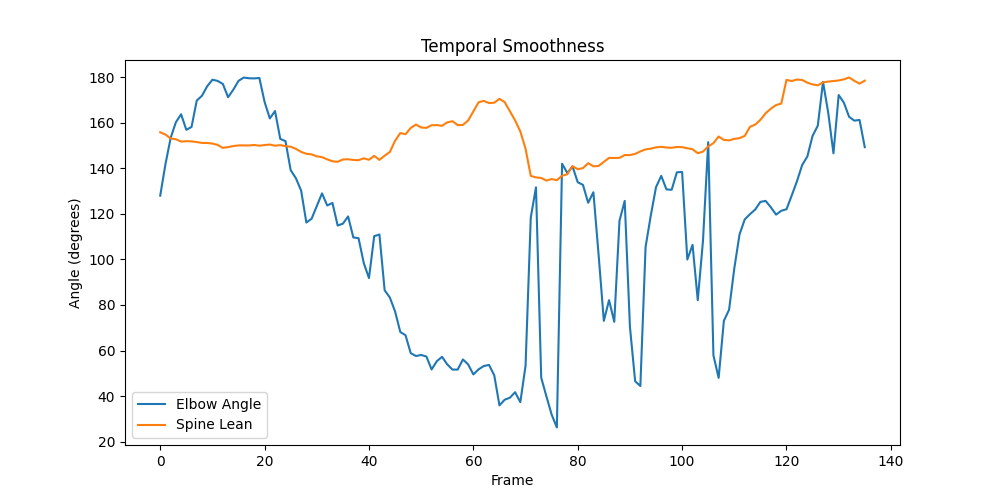

# AI-Powered Cricket Analytics

This project is a Python-based system that analyzes cricket cover drive shots from a full video in real-time. It uses pose estimation to extract key biomechanical metrics and provides feedback on the player's performance. The output is an annotated video with live overlays and a final shot evaluation.

## Features

*   **Real-Time Video Processing:** Analyzes full cricket videos without the need for manual keyframe extraction.
*   **Pose Estimation:** Extracts key body joint positions frame-by-frame using MediaPipe.
*   **Biomechanical Analysis:** Calculates key metrics like elbow angle, spine lean, head position, and foot direction.
*   **Live Overlays:** Visualizes the player's skeleton, real-time metrics, and feedback cues on the output video.
*   **Final Evaluation:** Generates a summary report with scores and actionable feedback for different aspects of the shot.
*   **Streamlit Mini-App:** A simple web interface to upload a video, view the analysis, and download the results.

## Scope & Requirements

### Base Requirements

*   Process a full video and output an annotated MP4 video.
*   Extract and display pose estimation for head, shoulders, elbows, wrists, hips, knees, and ankles.
*   Compute and display at least three biomechanical metrics in real-time.
*   Provide real-time feedback cues based on performance thresholds.
*   Generate a final evaluation file (`evaluation.json`) with scores and comments for:
    *   Footwork
    *   Head Position
    *   Swing Control
    *   Balance
    *   Follow-through

### Bonus Features (Advanced)

This project also aims to implement the following advanced features:

*   **Automatic Phase Segmentation:** Automatically detect different phases of the cover drive (stance, stride, downswing, impact, follow-through, recovery).
*   **Contact-Moment Auto-Detection:** Automatically identify the point of bat-ball contact.
*   **Temporal Smoothness & Consistency:** Analyze the smoothness of the player's movements.
*   **Real-Time Performance Target:** Achieve a processing speed of at least 10 FPS on a CPU.
*   **Reference Comparison:** Compare the analyzed shot to an "ideal" cover drive model.
*   **Basic Bat Detection/Tracking:** Approximate the bat's swing path.
*   **Skill Grade Prediction:** Classify the player's skill level as Beginner, Intermediate, or Advanced.
*   **Streamlit Mini-App:** A web-based interface for video upload, analysis, and results download.
*   **Robustness & UX:** Implement fail-safe logging, a configuration file for settings, and a modular analysis function.
*   **Report Export:** Generate a summary report in HTML or PDF format.

## Deliverables

*   `app.py`: The Streamlit web app.
*   `cover_drive_analysis_realtime.py`: The main Python script for the analysis.
*   `/output/`: A directory containing the output files:
    *   `annotated_video.mp4`: The annotated video with overlays.
    *   `evaluation.json`: The final evaluation report.
*   `requirements.txt`: A list of required Python packages.
*   `README.md`: This file.

## Setup & Run Instructions

1.  **Clone the repository:**
    ```bash
    git clone https://github.com/Dhruv-D-Bhrasadiya/AI-Powered-Cricket-Analytics.git
    cd AI-Powered-Cricket-Analytics
    ```
2.  **Install the dependencies:**
    ```bash
    pip install -r requirements.txt
    ```
3.  **Run the Streamlit app:**
    ```bash
    streamlit run app.py
    ```
    OR 
    ```bash
    python cover_drive_analysis_realtime.py
    ```
4.  **Open your web browser** and go to the URL provided by Streamlit.
5.  **Upload a video** of a cover drive and wait for the analysis to complete both are available in the repository.
6.  **View the results** and download the annotated video and evaluation report.

## Example: Input & Outputs (Cover Drive)

Below is a real example from this repo. You can play the input and annotated videos right here, and open the reports with one click.

### Input Video

<video src="https://github.com/Dhruv-D-Bhrasadiya/AI-Powered-Cricket-Analytics/blob/main/input_video.mp4?raw=true" controls title="input_video.mp4" width="">
</video>

---

### Output: Annotated Video
<video src="https://github.com/Dhruv-D-Bhrasadiya/AI-Powered-Cricket-Analytics/blob/main/output/annotated_video.mp4?raw=true" controls title="output/annotated_video.mp4" width="">
</video>

---

### Output: Temporal Smoothness
<p align="left">
  
</p>

---

### Output Reports
- 📄 **Evaluation (JSON):** [`output/evaluation.json`](./output/evaluation.json)
- 🧾 **Evaluation Report (TXT):** [`output/evaluation_report.txt`](./output/evaluation_report.txt)


## Assumptions & Limitations

*   The video should be of a single player performing a cover drive.
*   The player should be clearly visible in the video.
*   The camera angle should be relatively stable.
*   The accuracy of the analysis depends on the quality of the video and the performance of the pose estimation model.

## Tech Stack

*   **Python:** The core programming language.
*   **OpenCV:** For video processing and analysis.
*   **MediaPipe:** For pose estimation.
*   **Streamlit:** For the web-based user interface.
*   **scikit-learn:** For machine learning tasks (e.g., skill grade prediction).
*   **NumPy:** For numerical computations.
